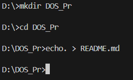
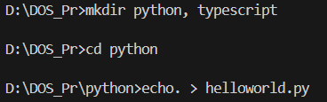
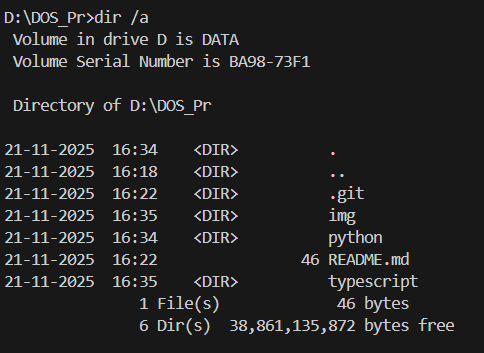
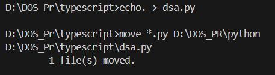
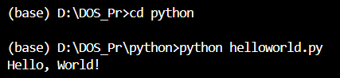

# NIC Internship DOS Command - What did i learn?

A quick reference guide for common DOS/Windows command-line operations and development commands i learnt.

## 📸 Example Use Cases

### Example 1: Creating Project Directory and README



```bash
mkdir DOS_Pr
cd DOS_Pr
echo. > README.md
```

This shows how to create a new project folder and initialize a README file.

### Example 2: Creating Multiple Folders and Files



```bash
mkdir python, typescript
cd python
echo. > helloworld.py
```

Demonstrates creating multiple directories at once and adding a Python file.

### Example 3: Listing All Files (Including Hidden)



```bash
dir /a
```

The `/a` flag displays all files including hidden ones like `.git` folders.

### Example 4: Moving Files Between Directories



```bash
cd typescript
echo. > dsa.py
move *.py D:\DOS_Pr\python
```

Shows how to create a file in the wrong directory and move it to the correct location using wildcards.

### Example 5: Running Python Scripts



```bash
cd python
python helloworld.py
# Output: Hello, World!
```

Demonstrates navigating to a directory and executing a Python script.

## 📁 File & Directory Management

### Navigation & Listing

```bash
# Show all files including hidden files (like .git)
dir /a

# Change directory
cd folder_name
```

### Creating Files & Folders

```bash
# Create a new folder
mkdir folder_name

# Create a new file
echo. > file_name.ext
```

### Moving Files

```bash
# Move file from one folder to another
move source_folder\file_name.ext destination_folder\

# Alternative file moving/copying commands
robocopy source destination [options]
xcopy source destination [options]
del file_name  # Delete files
```

## 💻 Development Commands

### Python

```bash
# Install Python package
pip install library_name

# Run Python script
py file_name.py
```

### Node.js/JavaScript

```bash
# Install npm package
npm install package_name

# Run development server
npm run dev
```

### C/C++ Compilation

```bash
# Compile C file with GCC
gcc file_name.c -o output_file.exe
```

## 📂 Project Structure

```
.
├── python/
│   └── helloworld.py
├── typescript/
│   └── script.ts
└── README.md
```